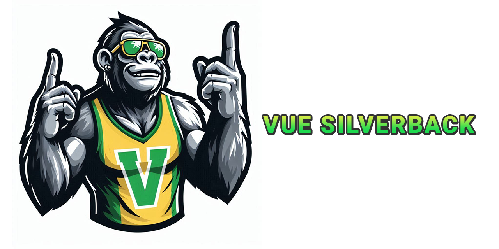

# Vue Silverback



Vue Silverback é uma biblioteca de componentes personalizáveis para Vue.js 3, criada para facilitar a construção de interfaces modernas e responsivas. Esta biblioteca inclui componentes reutilizáveis e estilizados que podem ser facilmente integrados em qualquer projeto Vue.

## Instalação

Para instalar a biblioteca, execute:

```bash
npm install vue-silverback
```
